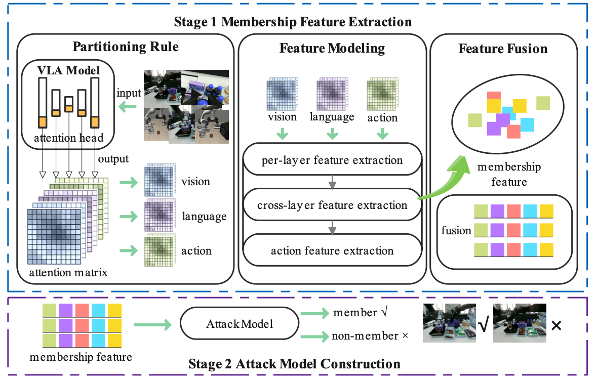

<h1 align="center">VLALeaks: Membership Inference Attacks against Vision-Language-Action Models</h1>

<p align="center">Xukun Luan, Jinyan Liu, Xuesong Li, Yuanguo Bi, Renjun Wu, Zhongxiang Lei, and Di Wang</p>

<div align="center">

</div>

Vision-Language-Action (VLA) models enable end-to-end robot control and have garnered widespread attention. However, the memorization of training data inherent to VLA, coupled with the high cost of robotic data acquisition, raises serious concerns regarding data privacy leakage and intellectual property infringement. Membership inference attacks (MIAs) aim to determine whether a given sample belongs to the training set. While representing a significant privacy threat, this attack remains underexplored in the context of VLA models. To bridge this gap, we propose VLALeaks, which is based on attention discrepancies in VLA models. We reveal, for the first time, the privacy vulnerabilities of VLA models. Specifically, it comprises a two-stage process: (1) membership feature extraction, and (2) attack model construction. Experimental results across multiple VLA benchmarks demonstrate that VLALeaks readily reveals membership information and achieves optimal attack AUC and TPR@1\%FPR, highlighting the privacy vulnerabilities in current VLA model deployments. Our work is the first systematic study of MIAs on VLA models, aiming to provide insights for secure and trustworthy VLA models.

## Overview
💡 The attack pipeline is divided into two strictly sequential stages:
1. **Stage 1**: Extract sensitive membership leakage features from the target VLA model.
2. **Stage 2**: Train and evaluate a binary attack model to distinguish member and non-member samples.

## Environment Setup
### Basic Hardware & Software Requirements
- Python = 3.10
- PyTorch = 2.2.0
- CUDA = 12.1

### Install Dependencies

🧠 This project is built on top of [OpenVLA](https://github.com/openvla/openvla), so please follow its installation instructions to configure the base environment first.

🧪 Experiments are conducted in the [LIBERO](https://github.com/Lifelong-Robot-Learning/LIBERO) simulation environment. Make sure to install LIBERO and its dependencies as described in their official documentation. Additional support can be provided by [LIBERO+](https://github.com/sylvestf/LIBERO-plus).

If you have sufficient GPUs, you can fine-tune OpenVLA using a subset of LIBERO. If not, you can download the already fine-tuned model [here](https://huggingface.co/openvla) and complete the experiments with the assistance of LIBERO+.

## Run Attack Pipeline
⚠️ Execution order cannot be reversed: Stage 1 must finish before launching Stage 2

### Stage 1: Membership Feature Extraction
Script path: 
```bash
vla-scripts/vlaleaks_stage1.py
```
### Stage 2: Attack Model Construction
Script path: 
```bash
vla-scripts/vlaleaks_stage2.py
```

If you use our code in your work, please cite [our paper](https://arxiv.org/abs/2606.15165):
```bibtex
@misc{luan2026vlaleaksmembershipinferenceattacks,
      title={VLALeaks: Membership Inference Attacks against Vision-Language-Action Models}, 
      author={Xukun Luan and Jinyan Liu and Xuesong Li and Yuanguo Bi and Renjun Wu and Zhongxiang Lei and Di Wang},
      year={2026},
      eprint={2606.15165},
      archivePrefix={arXiv},
      primaryClass={cs.CR},
      url={https://arxiv.org/abs/2606.15165}, 
}
```
